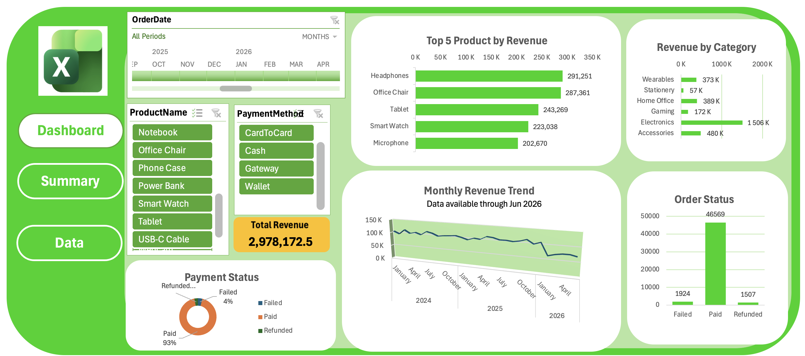

# E-Commerce Sales Data Analysis

An interactive **Excel-based E-Commerce Sales Analysis Dashboard** developed to transform raw transactional data into meaningful business insights.

## Dashboard Preview
## Dashboard Preview


(https://github.com/shiblidata/ecommerce-sales-analysis-excel/blob/main/images/dashboard_preview.png)
## Project Overview

This project analyzes e-commerce data across **orders, customers, products and payments**.

The complete workflow includes:

**Data Cleaning → Data Transformation → Data Integration → Analysis → Interactive Dashboard**

The original order dataset contained approximately **50,500 records**, which was cleaned to around **50,000 unique orders**.

## Tools Used

- Microsoft Excel
- Power Query
- PivotTables
- PivotCharts
- Slicers
- Timeline
- Excel Formulas

## Data Preparation

Key data preparation steps included:

- Removed duplicate records
- Checked and handled missing values
- Corrected data types
- Standardized inconsistent text values
- Merged Orders, Customers, Products, and Payments datasets
- Created calculated sales and revenue fields
- Added Year and Month fields for trend analysis

## Revenue Calculation

```text
Gross Sales = Quantity × Unit Price
Discount Amount = Gross Sales × Discount
Net Sales = Gross Sales - Discount Amount
```

Revenue was counted only when:

```text
Order Status = Completed
AND
Payment Status = Paid
```

## Dashboard Highlights

- **Total Revenue:** 2,978,172.55
- Top 10 Products by Revenue
- Revenue by Category
- Monthly Revenue Trend
- Payment Status Analysis
- Order Status Analysis
- Product Name Slicer
- Payment Method Slicer
- Order Date Timeline
- Dynamic Total Revenue KPI

## Business Questions

The dashboard helps answer:

- Which products generate the highest revenue?
- Which categories contribute the most revenue?
- How does revenue change over time?
- What is the distribution of payment statuses?
- What is the distribution of completed, cancelled and returned orders?
- How does revenue change across products, payment methods and time periods?

## Repository Structure

```text
ecommerce-sales-analysis-excel/
│
├── README.md
├── Ecommerce_Sales_Data_Analysis.xlsx
├── data/
│   ├── customers.csv
│   ├── orders.csv
│   ├── products.csv
│   └── payments.csv
└── images/
    └── dashboard_preview.png
```

## Skills Demonstrated

- Data Cleaning
- Data Transformation
- Power Query
- Data Integration
- PivotTable Analysis
- PivotChart Development
- KPI Development
- Interactive Dashboard Design
- Data Visualization
- Business Data Analysis

## Author

**Md. Mehedi Hasan Shibli**  
BSc in Computer Science & Engineering  
American International University-Bangladesh (AIUB)
